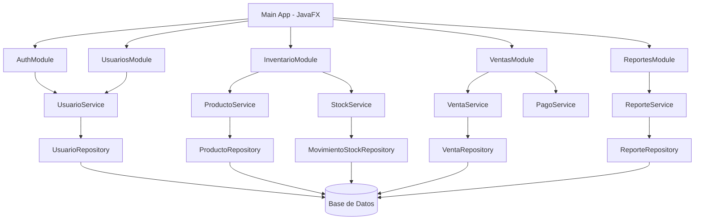
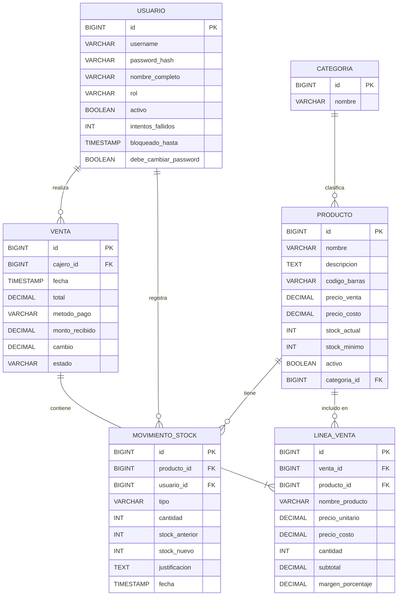

# Documento de Diseño: Sistema de Punto de Venta (POS)

## Visión General

El sistema POS es una aplicación de escritorio desarrollada en **Java 17+ con JavaFX 21**, empaquetada como instalador nativo para Windows mediante **jpackage**. Utiliza una arquitectura en capas (MVC + Repository) con soporte para múltiples motores de base de datos a través de **JDBC + Hibernate ORM**.

La aplicación opera completamente offline con SQLite como base de datos embebida por defecto, y permite configurar PostgreSQL o MySQL para entornos con servidor de base de datos existente.

---

## Arquitectura

### Patrón Arquitectónico: MVC en Capas

```
┌─────────────────────────────────────────────┐
│              Capa de Presentación            │
│         JavaFX Views + Controllers           │
│         (FXML + CSS + Controller.java)       │
└──────────────────┬──────────────────────────┘
                   │
┌──────────────────▼──────────────────────────┐
│              Capa de Servicios               │
│         Business Logic / Use Cases           │
│    (VentaService, InventarioService, etc.)   │
└──────────────────┬──────────────────────────┘
                   │
┌──────────────────▼──────────────────────────┐
│           Capa de Repositorios               │
│         Data Access Objects (DAO)            │
│   (ProductoRepository, VentaRepository...)   │
└──────────────────┬──────────────────────────┘
                   │
┌──────────────────▼──────────────────────────┐
│           Capa de Persistencia               │
│       Hibernate ORM + JDBC                   │
│    SQLite (default) / PostgreSQL / MySQL     │
└─────────────────────────────────────────────┘
```

### Diagrama de Módulos



---

## Componentes e Interfaces

### Componentes Principales

#### 1. `MainApp.java`
Punto de entrada de la aplicación JavaFX. Inicializa el contexto de la aplicación, configura la base de datos y carga la pantalla de login.

#### 2. `DatabaseConfig.java`
Gestiona la configuración de la conexión a la base de datos. Lee el archivo `config.properties` para determinar el tipo de BD (SQLite/PostgreSQL/MySQL) y configura Hibernate.

```java
public interface DatabaseConfig {
    SessionFactory buildSessionFactory();
    DatabaseType getDatabaseType(); // SQLITE, POSTGRESQL, MYSQL
}
```

#### 3. Servicios (Business Logic)

```java
public interface ProductoService {
    Producto crear(ProductoDTO dto);
    Producto actualizar(Long id, ProductoDTO dto);
    void desactivar(Long id);
    Optional<Producto> buscarPorCodigo(String codigoBarras);
    List<Producto> buscarPorNombreOCategoria(String termino);
    List<Producto> listarActivos();
    List<Producto> listarBajoStockMinimo();
}

public interface StockService {
    void registrarEntrada(Long productoId, int cantidad, String justificacion, Long usuarioId);
    void registrarAjuste(Long productoId, int nuevaCantidad, String justificacion, Long usuarioId);
    List<MovimientoStock> historialPorProducto(Long productoId);
}

public interface VentaService {
    Venta iniciarVenta(Long cajeroId);
    Venta agregarLinea(Long ventaId, String codigoBarras, int cantidad);
    Venta modificarCantidadLinea(Long ventaId, Long lineaId, int nuevaCantidad);
    Venta eliminarLinea(Long ventaId, Long lineaId);
    Venta completarVenta(Long ventaId, MetodoPago metodo, BigDecimal montoRecibido);
    void cancelarVenta(Long ventaId);
}

public interface ReporteService {
    ReporteVentas generarReporteVentas(LocalDate desde, LocalDate hasta);
    ReporteInventario generarReporteInventario();
    byte[] exportarPDF(Reporte reporte);
}

public interface UsuarioService {
    Usuario crear(UsuarioDTO dto);
    void desactivar(Long id);
    void cambiarContrasena(Long id, String nuevaContrasena);
    Optional<Usuario> autenticar(String username, String passwordHash);
    void registrarIntentoFallido(String username);
    boolean estaBloqueado(String username);
}
```

#### 4. Repositorios (Data Access)

```java
public interface ProductoRepository {
    Producto save(Producto p);
    Optional<Producto> findById(Long id);
    Optional<Producto> findByCodigoBarras(String codigo);
    List<Producto> findByNombreContainingOrCategoria(String termino);
    List<Producto> findAllActivos();
    List<Producto> findBajoStockMinimo();
}

public interface VentaRepository {
    Venta save(Venta v);
    Optional<Venta> findById(Long id);
    List<Venta> findByFechaBetween(LocalDateTime desde, LocalDateTime hasta);
    List<VentaResumen> sumByMetodoPago(LocalDate desde, LocalDate hasta);
}

public interface MovimientoStockRepository {
    MovimientoStock save(MovimientoStock m);
    List<MovimientoStock> findByProductoId(Long productoId);
}

public interface UsuarioRepository {
    Usuario save(Usuario u);
    Optional<Usuario> findByUsername(String username);
    List<Usuario> findAllActivos();
}
```

#### 5. Servicio de Importación Excel

```java
public interface ExcelImportService {
    // Previsualiza los datos sin persistir nada
    ImportPreview previsualizarExcel(File archivo);
    // Ejecuta la importación real
    ImportResult importarExcel(File archivo);
}

public record ImportPreview(
    List<FilaExcel> filas,       // datos parseados
    List<String> errores,        // filas con problemas
    int productosNuevos,         // productos que se crearían
    int ventasARegistrar         // ventas que se registrarían
) {}

public record ImportResult(
    int productosCreados,
    int ventasRegistradas,
    int filasConError,
    List<String> detalleErrores
) {}

public record FilaExcel(
    String articulo,
    BigDecimal precioVenta,
    LocalTime horaVenta,           // hora parseada de la columna 3 (formato 12h AM/PM)
    LocalDateTime fechaHoraVenta,  // construida combinando fecha del nombre de hoja + horaVenta
    boolean valida,
    String mensajeError
) {}
```

La librería utilizada para leer Excel es **Apache POI** (soporte .xlsx y .xls).

Lógica de importación:
1. Iterar sobre cada hoja del archivo Excel; el nombre de cada hoja representa la fecha (mes y día) de las ventas que contiene
2. Parsear la fecha del nombre de la hoja; si el nombre no puede interpretarse como fecha, registrar el error y omitir la hoja completa
3. Para cada fila de la hoja: parsear la hora de la columna 3 en formato 12h AM/PM (ej: `10:56:56 a. m.`) y combinarla con la fecha de la hoja para construir el `LocalDateTime` completo de la venta
4. Construir un mapa de artículos únicos (deduplicación por nombre, case-insensitive)
5. Para cada artículo nuevo: crear producto con stock=100 y precio_costo=0 (el administrador lo completa después)
6. Para cada fila válida: registrar una venta individual con el `LocalDateTime` construido en el paso 3
7. El margen no se calcula en la importación dado que precio_costo es 0; queda pendiente hasta que el administrador asigne el costo real
8. Acumular errores sin detener el proceso

#### 6. Controladores JavaFX (UI)

| Controlador | Vista FXML | Responsabilidad |
|---|---|---|
| `LoginController` | `login.fxml` | Autenticación de usuarios |
| `MainController` | `main.fxml` | Navegación principal y menú |
| `VentaController` | `venta.fxml` | Pantalla de caja / POS |
| `ProductoController` | `producto.fxml` | CRUD de productos |
| `InventarioController` | `inventario.fxml` | Gestión de stock y movimientos |
| `ReporteController` | `reporte.fxml` | Generación y exportación de reportes |
| `UsuarioController` | `usuario.fxml` | Gestión de usuarios |
| `ImportarController` | `importar.fxml` | Importación de datos desde Excel |

---

## Modelos de Datos

### Diagrama Entidad-Relación



### Entidades Java (Hibernate)

```java
@Entity @Table(name = "producto")
public class Producto {
    @Id @GeneratedValue Long id;
    String nombre;
    String descripcion;
    @Column(unique = true) String codigoBarras;
    BigDecimal precioVenta;
    BigDecimal precioCosto;
    int stockActual;
    int stockMinimo;
    boolean activo;
    @ManyToOne Categoria categoria;
}

@Entity @Table(name = "venta")
public class Venta {
    @Id @GeneratedValue Long id;
    @ManyToOne Usuario cajero;
    LocalDateTime fecha;
    BigDecimal total;
    @Enumerated MetodoPago metodoPago;
    BigDecimal montoRecibido;
    BigDecimal cambio;
    @Enumerated EstadoVenta estado; // EN_CURSO, COMPLETADA, CANCELADA
    @OneToMany(cascade = ALL) List<LineaVenta> lineas;
}
```

### DTOs de Transferencia

```java
public record ProductoDTO(
    String nombre, String descripcion, String codigoBarras,
    BigDecimal precioVenta, BigDecimal precioCosto,
    int stockInicial, int stockMinimo, Long categoriaId
) {}

public record VentaResumenDTO(
    Long id, LocalDateTime fecha, BigDecimal total,
    String metodoPago, String cajero, int numLineas
) {}

public record ReporteVentasDTO(
    LocalDate desde, LocalDate hasta,
    int totalVentas, BigDecimal totalRecaudado,
    Map<MetodoPago, BigDecimal> porMetodoPago,
    List<ProductoVendidoDTO> masVendidos
) {}
```

---

## Propiedades de Corrección

*Una propiedad es una característica o comportamiento que debe mantenerse verdadero en todas las ejecuciones válidas del sistema. Las propiedades sirven como puente entre las especificaciones legibles por humanos y las garantías de corrección verificables automáticamente.*

### Descripción General de Pruebas Basadas en Propiedades

Las pruebas basadas en propiedades (PBT) validan la corrección del software probando propiedades universales a través de muchas entradas generadas. Cada propiedad es una especificación formal que debe mantenerse para todas las entradas válidas.

---

**Propiedad 1: Consistencia del stock tras una venta**
*Para cualquier* producto con stock suficiente, al completar una venta que incluye ese producto con cantidad `q`, el stock resultante debe ser exactamente `stock_anterior - q`.
**Valida: Requisito 2.1**

---

**Propiedad 2: El stock nunca es negativo**
*Para cualquier* secuencia de ventas y ajustes, el stock de cualquier producto nunca debe ser menor a cero.
**Valida: Requisito 2.4**

---

**Propiedad 3: Cálculo correcto del total de venta**
*Para cualquier* lista de líneas de venta, el total de la venta debe ser igual a la suma de todos los subtotales, donde cada subtotal es `precio_unitario × cantidad`.
**Valida: Requisito 3.4**

---

**Propiedad 4: Cálculo correcto del cambio en efectivo**
*Para cualquier* venta pagada en efectivo con monto recibido `m` y total `t` donde `m >= t`, el cambio calculado debe ser exactamente `m - t`.
**Valida: Requisito 4.2**

---

**Propiedad 5: Idempotencia de cancelación de venta**
*Para cualquier* venta en estado EN_CURSO, cancelarla debe dejar el stock de todos los productos involucrados sin cambios respecto al estado previo al inicio de la venta.
**Valida: Requisito 3.8**

---

**Propiedad 6: Unicidad de código de barras**
*Para cualquier* conjunto de productos registrados, no pueden existir dos productos activos con el mismo código de barras.
**Valida: Requisito 1.2**

---

**Propiedad 7: Consistencia del reporte de ventas**
*Para cualquier* rango de fechas, el total recaudado en el reporte debe ser igual a la suma de los totales de todas las ventas completadas en ese período.
**Valida: Requisito 5.1**

---

**Propiedad 8: Bloqueo de cuenta por intentos fallidos**
*Para cualquier* usuario, después de exactamente 5 intentos de autenticación fallidos consecutivos, el sistema debe bloquear la cuenta y rechazar intentos adicionales durante 15 minutos.
**Valida: Requisito 7.5**

---

**Propiedad 9: Valor total del inventario**
*Para cualquier* estado del inventario, el valor total reportado debe ser igual a la suma de `stock_actual × precio_costo` para todos los productos activos.
**Valida: Requisito 6.2**

---

**Propiedad 10: Importación Excel crea productos faltantes con stock 100 y costo 0**
*Para cualquier* archivo Excel válido, todos los artículos que no existan previamente en el inventario deben ser creados con stock inicial de 100 unidades y precio de costo 0 tras la importación.
**Valida: Requisito 9.2**

---

**Propiedad 11: Importación Excel registra ventas con fechahora correcta**
*Para cualquier* archivo Excel válido, cada fila válida debe generar exactamente una venta registrada cuya fechahora se construye combinando la fecha del nombre de la hoja con la hora de la columna 3 (formato 12h AM/PM).
**Valida: Requisito 9.3**

---

**Propiedad 12: Filas inválidas no detienen la importación**
*Para cualquier* archivo Excel con mezcla de filas válidas e inválidas, las filas válidas deben importarse correctamente y las inválidas deben registrarse como errores sin afectar las demás.
**Valida: Requisito 9.4**

---

## Manejo de Errores

### Estrategia General

- Todas las excepciones de negocio extienden `PosException` (checked)
- Las excepciones de infraestructura (BD, IO) se envuelven en `PosRuntimeException`
- Los controladores JavaFX capturan excepciones y muestran diálogos de error al usuario
- Se registra un log de errores en `%APPDATA%\PuntoDeVenta\logs\app.log`

### Excepciones de Negocio

```java
public class StockInsuficienteException extends PosException {
    private final int stockDisponible;
    private final int cantidadSolicitada;
}

public class CodigoBarrasDuplicadoException extends PosException {
    private final String codigoBarras;
}

public class VentaVaciaException extends PosException {}

public class PagoInsuficienteException extends PosException {
    private final BigDecimal totalVenta;
    private final BigDecimal montoRecibido;
}

public class UsuarioBloqueadoException extends PosException {
    private final LocalDateTime bloqueadoHasta;
}

public class CredencialesInvalidasException extends PosException {}
```

### Validaciones de Entrada

- Precios y cantidades: valores positivos, máximo 2 decimales para precios
- Nombres de producto: 2–200 caracteres, no vacíos
- Código de barras: alfanumérico, 4–50 caracteres
- Contraseñas: mínimo 8 caracteres

---

## Estrategia de Pruebas

### Enfoque Dual: Pruebas Unitarias + Pruebas Basadas en Propiedades

**Pruebas Unitarias** (JUnit 5):
- Casos específicos y condiciones de borde
- Integración entre componentes (Service + Repository con BD en memoria H2)
- Condiciones de error y excepciones

**Pruebas Basadas en Propiedades** (jqwik):
- Propiedades universales sobre todas las entradas válidas
- Mínimo 100 iteraciones por propiedad
- Generadores personalizados para entidades del dominio

### Configuración de Pruebas de Propiedades

Librería: **jqwik** (integración nativa con JUnit 5)

```java
// Ejemplo de anotación de propiedad
@Property(tries = 100)
// Feature: punto-de-venta, Property 3: Cálculo correcto del total de venta
void totalVentaEsSumaDeSubtotales(@ForAll List<@Positive BigDecimal> precios,
                                   @ForAll @IntRange(min=1, max=100) List<Integer> cantidades) {
    // ...
}
```

### Cobertura por Módulo

| Módulo | Tipo de Prueba | Propiedades Cubiertas |
|---|---|---|
| `StockService` | Propiedad + Unitaria | P1, P2 |
| `VentaService` | Propiedad + Unitaria | P3, P4, P5 |
| `ProductoService` | Propiedad + Unitaria | P6 |
| `ReporteService` | Propiedad + Unitaria | P7, P9 |
| `UsuarioService` | Propiedad + Unitaria | P8 |

### Herramientas

- **JUnit 5**: Framework de pruebas principal
- **jqwik**: Pruebas basadas en propiedades
- **Mockito**: Mocking de dependencias
- **H2 Database**: Base de datos en memoria para pruebas de integración
- **Apache POI**: Lectura de archivos Excel (.xlsx / .xls)
- **iText / OpenPDF**: Generación de reportes PDF
- **TestFX**: Pruebas de interfaz JavaFX (opcional)
